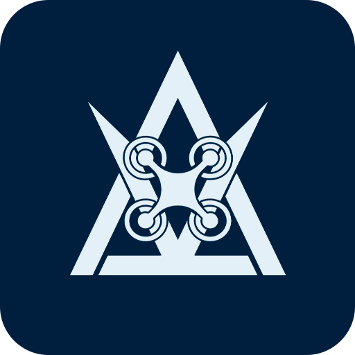

<h1> Bem-vindo(a) ao Projeto Delta V Drones!</h1>

Somos uma equipe de competição da **Universidade de Pernambuco (UPE - POLI)**, formada por estudantes e professores apaixonados por aeronáutica e tecnologia. Nosso foco é o desenvolvimento de drones de alto desempenho para participar de desafios de engenharia, como a competição **SAE Brasil Eletroquad**.

---

## Nossa Missão

> Nossa missão é projetar, construir e operar drones inovadores, aplicando na prática os conhecimentos de engenharia. Buscamos superar os desafios da competição, fomentar o desenvolvimento tecnológico e representar com excelência a nossa universidade no cenário nacional.

---

##  Nossos Setores

O projeto é organizado em setores multidisciplinares, onde cada equipe é responsável por uma parte crucial do nosso drone.

* **Aerodesign:** Responsável pelo projeto estrutural, aerodinâmico e pela fabricação da aeronave.
* **Visão Computacional:** Desenvolve algoritmos para que o drone possa "enxergar" e interpretar o ambiente, permitindo a navegação autônoma e a execução de tarefas.
* **Sistemas Embarcados:** Cuida do "cérebro" do drone, integrando hardware e software para processar dados e comandar os atuadores.
* **Sensores e Navegação:** Seleciona e integra os sensores que coletam os dados essenciais para o voo e a operação do drone.
* **Controle e Simulação:** Cria os modelos matemáticos e as lógicas de controle que garantem um voo estável e preciso, além de realizar simulações para prever e validar o comportamento da aeronave.

---

## Nossa Equipe

O **Delta V Drones** é movido pelas seguintes pessoas:

* **George Azevedo** - *Professor Coordenador* - [@george-azevedo](https://www.linkedin.com/in/george-azevedo-01970674/)
* **Carolyne Borges** - *Líder de Gestão* - [@carolyne-borges](https://www.linkedin.com/in/carolyne-borges-476a14371/)
* **Eliton Sena** - *Líder Operacional e Líder de Sensores e Navegação* - [@elitonsena](https://www.linkedin.com/in/elitonsena/)
* **Ana (Benny) Soares** - *Líder de Visão Computacional* - [@ana-soares](https://www.linkedin.com/in/ana-soares-absn1/)
* **Pedro Gabriel** - *Líder de Controle e Simulação* - [@pedro-gabriel-silva](https://www.linkedin.com/in/pedro-gabriel-silva-8541b3261/)
* **Gilvan Neto** - *Líder de Sistemas Embarcados* - [@gilvan-neto](https://www.linkedin.com/in/gilvan-neto-51124a2b0/)
* **??** - *Líder de Aerodesign* - [@usuario-membro](https://github.com/usuario-membro)
